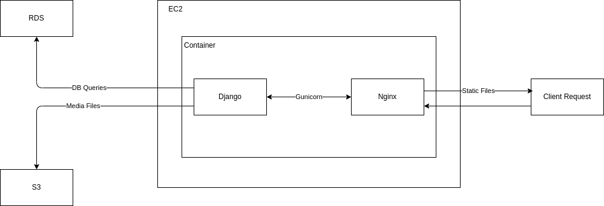
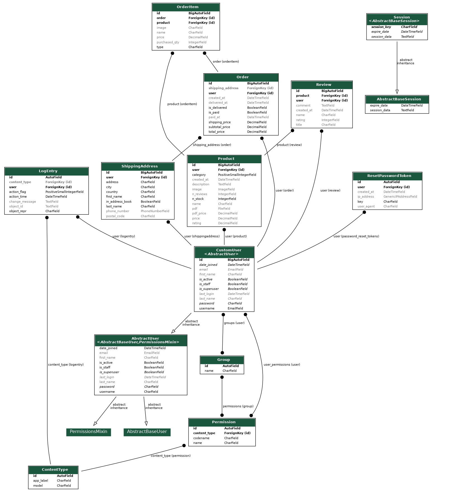
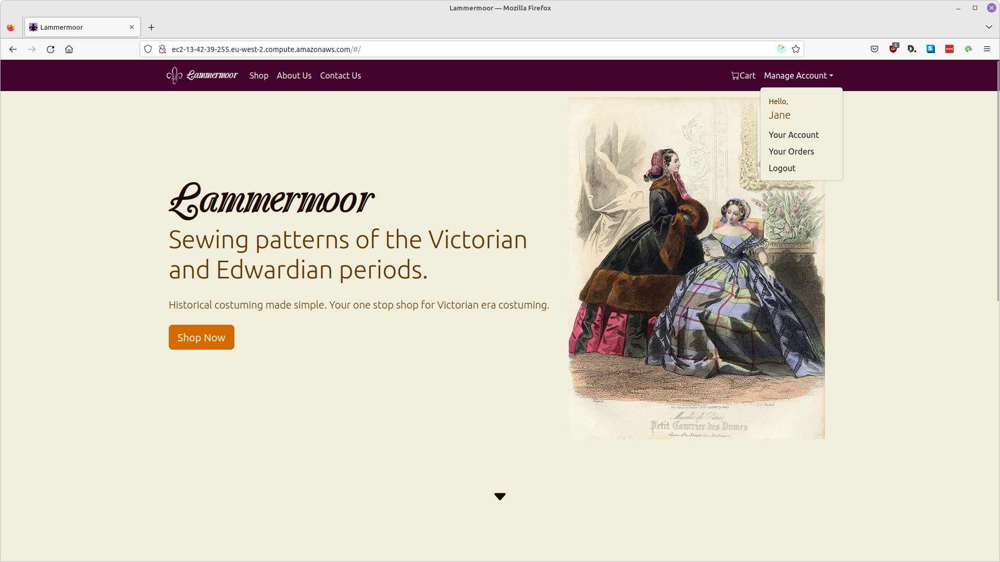
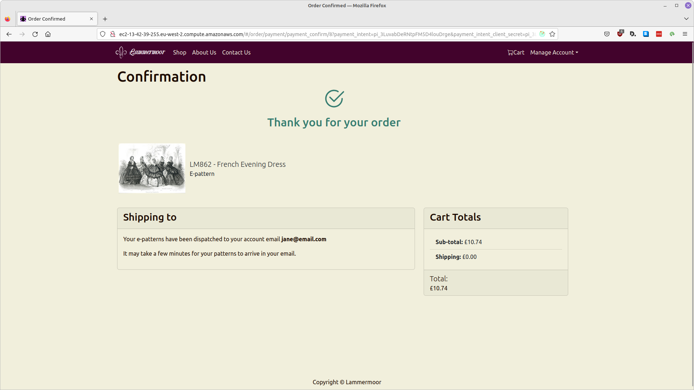
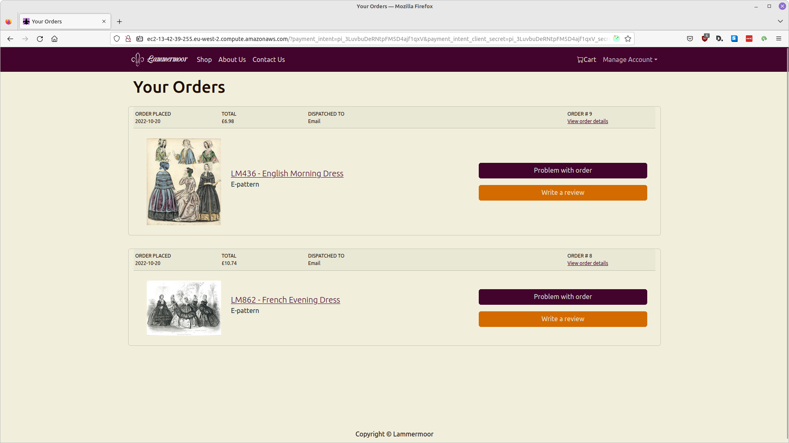
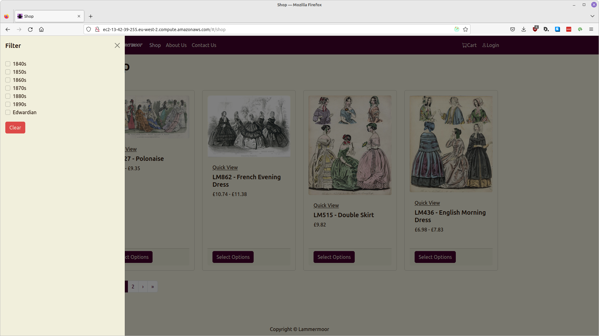
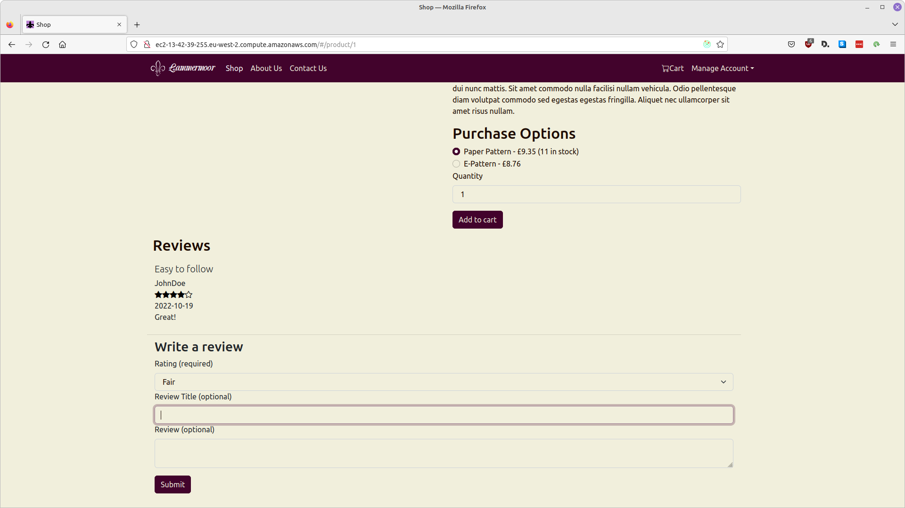

# E-Commerce Site (Lammermoor)

[Live Demo](http://ec2-13-42-39-255.eu-west-2.compute.amazonaws.com)

## Table of Contents
1. [About](#about)
2. [Deployment Architecture](#deployment-architecture)
3. [Database Schema](#database-schema)
4. [Technologies Used](#technologies-used)
5. [Gallery](#gallery)

## About

This project is a full stack e-commerce store for a fictional online retailer which sells clothing patterns as physical products and digital downloads. It features an authentication system which allows logged-in users to place orders, view order status, and manage account settings. There is an address book feature which allows users to save shipping addresses to reuse. The application is Dockerised and deployed on EC2. ([API Schema](http://ec2-13-42-39-255.eu-west-2.compute.amazonaws.com/api/schema/redoc))

### Django REST Framework + ReactJS

Django is used to serve model and view logic as a REST API with the React front end consuming the JSON responses and providing the template. Axios is used to make requests to the Django endpoints and Redux is used for state management.

### User Authentication

JSON Web Tokens (JWT) stored in local storage are used for user authentication. Local storage is accessible to any JavaScript code running on the same domain thus exposing the application to XSS attacks. Alternative implementations include storing JWTs as cookies and using a CSRF token or SameSite cookies. Django Rest Password Reset is used to provide and verify password reset tokens.

### Stripe Integration

A Stripe custom payment flow is integrated into this project. Stripe payment hooks are used to trigger order confirmation emails, update stock levels, and dispatch digital orders. The current implementation does not sufficiently guard against any errors occurring in the functions called after a hook has been triggered. Although Stripe does log payment events, a notification and logging system should be set up for the web hooks too.

### Task Queue

Celery is used to send emails asynchronously with Redis as the broker. While it has not been implemented in this project, there is potential to use Celery to run a recommender system.

## Deployment Architecture

There is a single deployment for the front end and back end. The React files are bundled and served via Django views as static files. The application is served from a single domain. This allows for tighter integration and makes deployment simpler without extra cross domain configuration. An alternative implementation is to serve the front end with a CDN service such as CloudFront which would allow an admin panel to be deployed as a separate application if implementing in the f

## Database Schema

This project utilises the Django ORM’s decimal field to store prices which can be vulnerable to floating point errors. The decimal module is used when writing to the database. An improvement would be to store prices as integers with a currency type to determine the number of decimal places. Alternatively, prices could be stored as strings.

## Technologies Used

- Django REST Framework
- ReactJS
- Redux
- Bootstrap
- PostgreSQL

## Gallery

